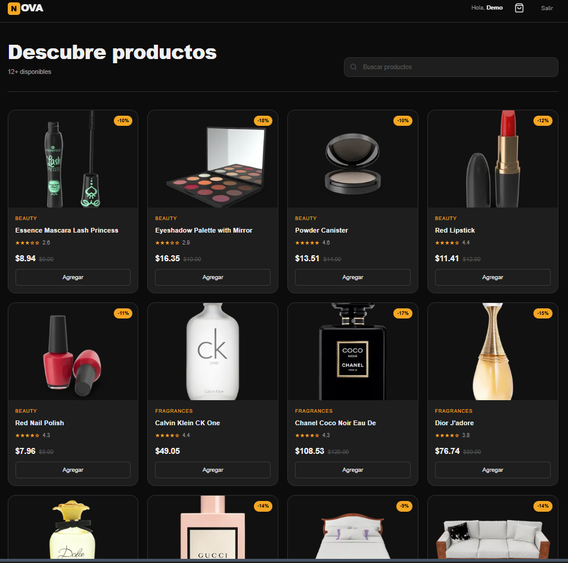
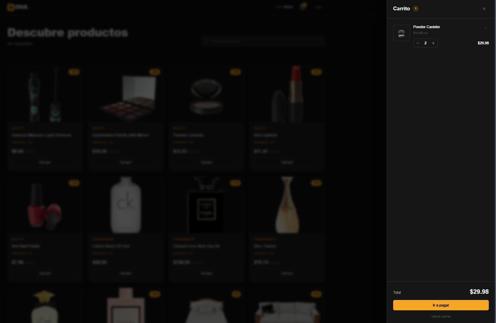
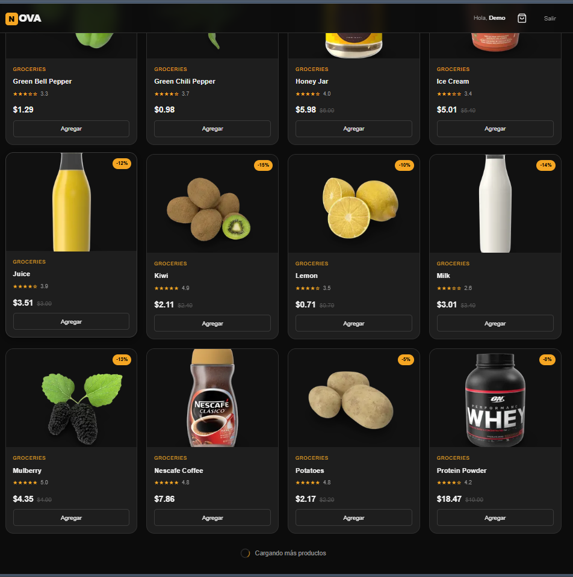

# React E-commerce Simulation

Live Demo: https://reactmarxwell.vercel.app/

---

## Screenshots

### Home



### Shopping Cart



### Infinite Scroll



---

## Overview

This project is a frontend-focused e-commerce simulation designed to replicate real-world user behavior and interaction patterns.

It was built as part of my transition from full-stack development to a more specialized frontend role, focusing on practical UI behavior, state management, and user experience.

---

## Key Features

* Infinite scroll product loading
* Shopping cart with localStorage persistence
* Simulated authentication flow
* Purchase flow simulation
* Dynamic UI updates based on user interaction

---

## Technical Decisions

* **LocalStorage persistence**
  Used to simulate real session continuity and maintain cart state across reloads.

* **Infinite Scroll (Intersection Observer)**
  Implemented to improve performance and user experience by loading content progressively.

* **Component-based architecture**
  Structured UI into reusable components for scalability and maintainability.

* **Client-side state handling**
  Focused on managing dynamic UI behavior without external state libraries.

---

## Frontend Focus

This project prioritizes frontend behavior and interaction:

* Dynamic rendering based on user actions
* Persistent UI state across sessions
* Simulated real-world flows (login, cart, purchase)
* Separation of UI logic into reusable components

---

## Tech Stack

* React
* JavaScript
* Vite
* CSS

---

## Getting Started

```bash
git clone https://github.com/MarxWellB/ecommerce-react-app.git
cd ecommerce-react-app
npm install
npm run dev
```

---

## Project Context

This project reflects my transition from building full-stack systems to focusing on frontend development.

While the implementation is intentionally simple in terms of tooling, the emphasis is on:

* Practical frontend problem solving
* Realistic user interaction patterns
* Clean UI behavior and state handling

More recent projects in my portfolio show improvements in:

* Code structure
* Naming conventions
* Frontend architecture

---

## Future Improvements

* Introduce TypeScript for stronger type safety
* Improve state management with Context API or Zustand
* Enhance UI with a design system (e.g. Tailwind CSS)
* Add filtering, search, and category features
* Connect to a real backend API

---

## Conclusion

This project demonstrates my ability to build interactive frontend applications with realistic behavior, focusing on user experience and dynamic state management.
